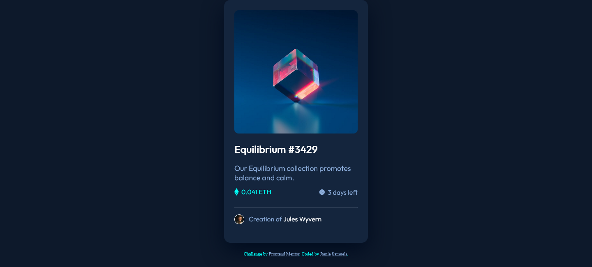

# Frontend Mentor - NFT preview card component solution

This is a solution to the [NFT preview card component challenge on Frontend Mentor](https://www.frontendmentor.io/challenges/nft-preview-card-component-SbdUL_w0U). Frontend Mentor challenges help you improve your coding skills by building realistic projects. 

## Table of contents

- [Overview](#overview)
  - [The challenge](#the-challenge)
  - [Screenshot](#screenshot)
  - [Links](#links)
- [My process](#my-process)
  - [Built with](#built-with)
  - [What I learned](#what-i-learned)
  - [Continued development](#continued-development)
  - [Useful resources](#useful-resources)
- [Author](#author)
- [Acknowledgments](#acknowledgments)


## Overview

### The challenge

Users should be able to:

- View the optimal layout depending on their device's screen size
- See hover states for interactive elements

### Screenshot



### Links

- Solution URL:(https://www.frontendmentor.io/solutions/nft-preview-card-component-Gress2McKo))
- Live Site URL:(https://jamieshortz.github.io/Web-Dev/nft-preview-card-component-main/index.html)

### Built with

- HTML
- CSS

### What I learned
I learned the proper use of containers in which they have a use that mimicks a child/parent relationship 
where each subsequent containers within are heavily influanced if they were used with the "position property."
Using floats only push an element to another element or to the left-most/right-most side of anoter element 
that contains them.

To see how you can add code snippets, see below:

```html
h2 id="name">Equilibrium #3429</h2>

        <div class="description">
          <span class="decstyle">Our Equilibrium collection promotes</span>
          <span class="decstyle">balance and calm.</span>
        </div>
```
```css
.view{
margin: auto;
position:absolute;
top: 150px;
left: 154px;
cursor:pointer;
transition: .1s background ease;
border-radius: 10px;
opacity: 0;
}
.view:hover{
background-color: hsl(178, 100%, 50%);
opacity: 0.5;
top: 25px;
left: 25px;
padding:126px;
}

```


### Continued development

CSS placements and html organization


## Author

- Website - [Jamie R Samuels](https://jamieshortz.github.io/Web-Dev/)
- Frontend Mentor - [@JamieShortz](https://www.frontendmentor.io/profile/JamieShortz)

## Acknowledgments

https://www.w3schools.com
https://developer.mozilla.org/

